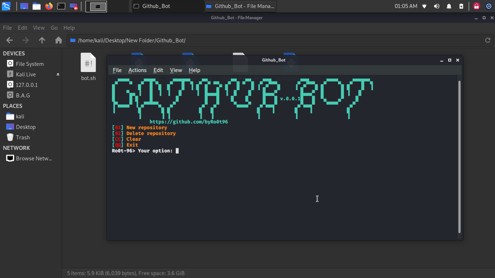

# Github_Bot




### Languages :

* BASH
* python

### System :

* Linux

# Requirements
[✓] selenium
[✓] urllib3

# SUPPORTED DISTRIBUTIONS
|Distribution | Version Check | supported | status |
----------|-------|------|-------|
|Kali Linux|2020.1 | yes | working   |

# How to get this app
```
cd
git clone https://github.com/byRo0t96/Github_Bot.git
cd Github_Bot
```

# How to run
```
bash bot.sh
```


## Release History
```
[◉] Version 0.0.1 [16-02-2020]
...
```

# USAGE
Please go to the [Youtube](https://youtu.be/HMvnF2vRROQ).

### Contact :

##### Mail : by.root96@gmail.com


